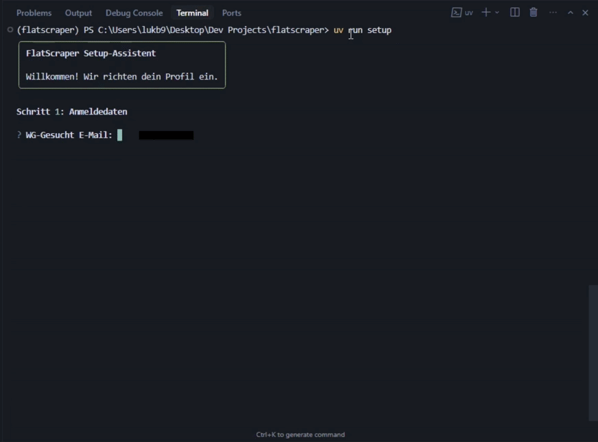

# 🏠 FlatScraper [](https://pypi.org/project/flatscraper/)

**Find WG rooms and apartments in hours, not weeks.** FlatScraper automates your search on [WG-Gesucht](https://www.wg-gesucht.de/): it discovers new listings, generates personalized messages with AI, and sends contact requests—so you can land multiple viewings while others are still refreshing the page.

---

## Why FlatScraper?

| The old way | With FlatScraper |
|-------------|------------------|
| Manually refresh WG-Gesucht | Automatically scans for new listings |
| Copy-paste generic messages | AI writes personalized Anschreiben for each ad |
| Hope your message stands out | Tailored tone: WG-friendly or landlord-professional |
| One viewing per week if you're lucky | **Multiple viewings in hours** |

---

## Demo

### Setup wizard (one-time, ~2 minutes)



### FlatScraper in action


---

## Features

- **Zero cost** – Runs entirely on [Groq's free tier](https://console.groq.com). No paid APIs.
- **Switch models** – Choose from Groq models (compound, llama, etc.) in setup or `.env`.
- **Personalized messages** – Your profile (age, job, personality, hobbies) shapes every Anschreiben.
- **Smart extraction** – Strips LLM meta-commentary; only the message is sent.
- **Rate limit handling** – Automatic retries with user feedback when Groq throttles.
- **Headless by default** – Runs in the background; use `--visible` for debugging.
- **Dry run** – `--no-send` to preview messages without sending.

---

## Quick start

### 1. Install

```powershell
#playwright for the browser automation
pip install flatscraper playwright
```

### 2. Install Playwright browser

```powershell
playwright install chromium
#or: uv sync
```

### 3. Run setup

```powershell
flatscraper setup
# or: uv run setup
```

The wizard guides you through:

1. WG-Gesucht credentials  
2. [Groq API key](https://console.groq.com) (free)  
3. Google Drive link for your documents  
4. Your profile (age, city, job, personality, hobbies)  
5. Model selection (Groq free-tier models)  
6. Search URLs from WG-Gesucht  

### 4. Run

```powershell
# Test run (no messages sent)
flatscraper --no-send
#or: uv run flatscraper --no-send

# Live run
flatscraper
#or: uv run flatscraper
```

---

## CLI reference

| Command | Description |
|---------|-------------|
| `flatscraper` | Run once: find listings, generate messages, send |
| `flatscraper --no-send` | Dry run: generate messages only, don't send |
| `flatscraper --visible` | Show browser window (default: headless) |
| `flatscraper --debug` | Include all listings (ignore age filter) |
| `flatscraper --schedule` | Run repeatedly on an interval |
| `flatscraper setup` | Run the setup wizard |

---

## Configuration

### Environment (`.env`)

| Variable | Required | Description |
|----------|----------|-------------|
| `FLATSCRAPER_EMAIL` | Yes | WG-Gesucht login email |
| `FLATSCRAPER_PASSWORD` | Yes | WG-Gesucht password |
| `GROQ_API_KEY` | Yes | [Groq API key](https://console.groq.com) (free tier) |
| `GOOGLE_DRIVE_LINK` | Yes | Google Drive folder with your documents |
| `GROQ_MODEL` | No | Model (default: `llama-3.1-8b-instant`) |
| `RUN_INTERVAL_MINUTES` | No | Schedule interval (default: `30`) |
| `AUTO_RUN_ENABLED` | No | Enable schedule (default: `false`) |

Copy `.env.example` to `.env` and fill in your values. **Never commit `.env` or `user_profile.json`**—they contain personal data.

### Profile (`user_profile.json`)

Created by the setup wizard. Contains your persona (for personalized messages) and search URLs. Edit manually or run `flatscraper setup` again.

---

## Groq models (free tier)

You can switch models in setup or via `GROQ_MODEL` in `.env`:

| Model | Notes |
|-------|-------|
| `groq/compound` | High throughput, good for many messages |
| `groq/compound-mini` | Fast, good for high frequency |
| `llama-3.3-70b-versatile` | Best text quality |
| `meta-llama/llama-4-scout-17b-16e-instruct` | Good balance |
| `llama-3.1-8b-instant` | Default, fast |

---

## Tests

```powershell
uv sync --extra dev
uv run pytest tests/ -v
```

---

## Project structure

```
flatscraper/
├── run.py             # Main entry point
├── config.py          # Settings + user profile
├── groq_client.py     # LLM client (Groq)
├── models.py          # Pydantic models
├── setup_wizard.py    # Interactive setup
├── .env.example       # Env template
└── platforms/
    └── wggesucht/     # WG-Gesucht implementation
```

---

## Supported platforms

| Platform   | Status |
|------------|--------|
| WG-Gesucht | ✅ Ready |

---

## License

MIT
